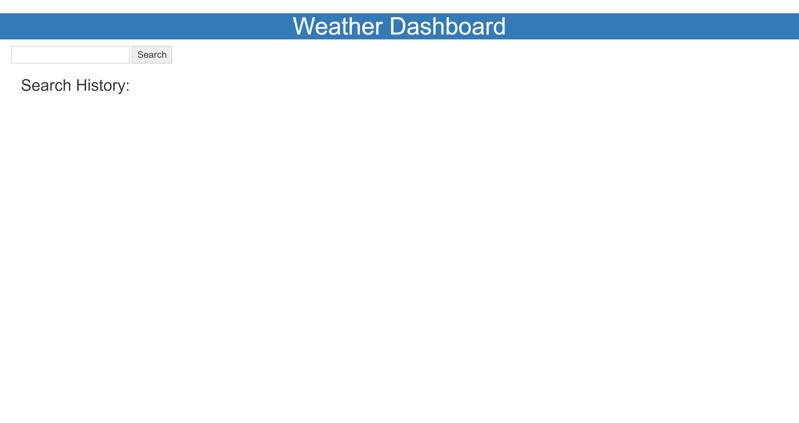

# Weather-Dashboard-06#
## Deployed Website
https://krysmit.github.io/weather-dashboard-06/
## GitHub Repository
https://github.com/krysmit/weather-dashboard-06

### Project Summary
This project is a weather dashboard that shows the weather for multiple cities when searched to help plan out a near-future trip.

### Functions of this page that meet the critera:
* When you search for a city, current and future weather information apppears.
* Each city is added to a search history area and then becomes clickable.
* For current weather condition, you will see the city name, the date, an icon representing the weather, the temp, humidity, wind speed, and UV.
* The UV is color coded to indication intensity of conditions.
* For future conditions, you will see a 5 day with the dates, an icon respresenting the weather, the temp, wind speed, and humitidy.